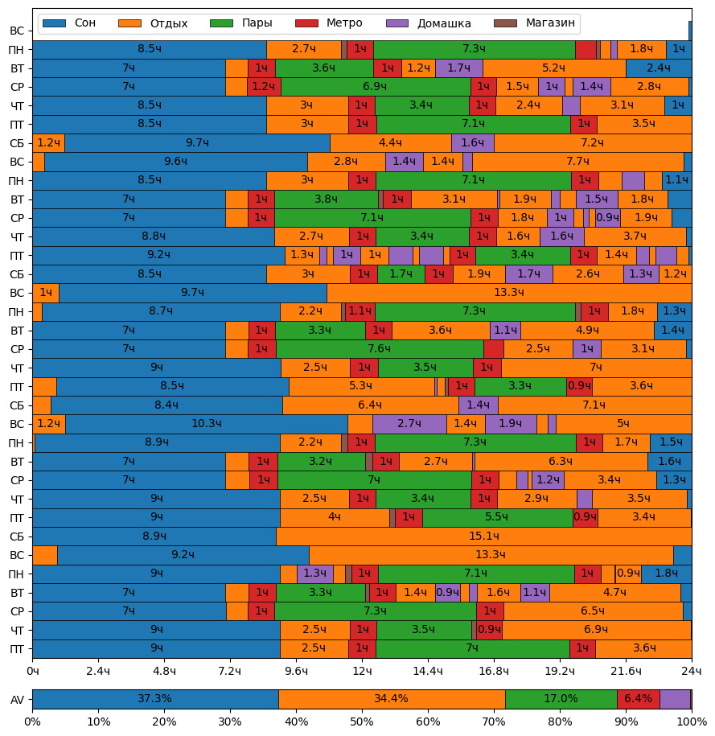
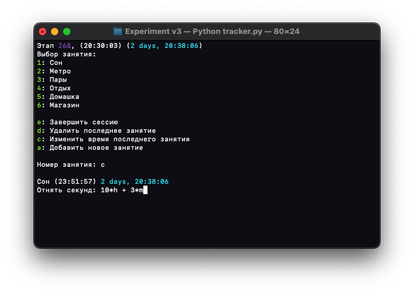

# Tracker  
Небольшое консольное приложения для мониторинга свободного времени. Основной скрипт запускается через `python3 tracker.py`

Также отдельно из файла `save.py` можно сгенерировать график через `python3 plot.py`, в коде графика вверху стоит константа на день начала, по умолчанию там воскресенье.

И вот такую круговую диаграмму. Она отображает 24 часовой циферблат, где вверху 0 часов, чуть левее 24, а радиус колец определяется неделями.
`python3 circles.py`

## Установка
Для работы необходим [Python3](https://www.python.org), модуль `matplotlib` для графиков и модуль `PIL` и `numpy` для генерации кружочка времени

`pip3 install -r requirements.txt`

## Использование
Для начала отслеживания данных, необходимо запустить главный скрипт через `python3 tracker.py`, в ходе работы этот скрипт создаст файл сохранения `save.py`, на основе файла сохранения скрипты `plot.py` и `circles.py` смогут сгенерировать графики распределения времени и кружочек времени. 

Если вы по мере работы главного скрипта добавляете новые активности, то необходимо расширить файл `constants.py` своими активностями и цветами для них, они нужны для генерации аналитики. Также при использовании скрипта в дейтвии изменения времени предыдущего этапа вы можете использовать следующий синтаксис:

Также рекоммендуется начинать эксперимент в 22:00:00 в воскресенье, и заканчивать его в этот же день и это время, но через несколько недель. Оптимальное время для эксперимента: 4-5 недель.