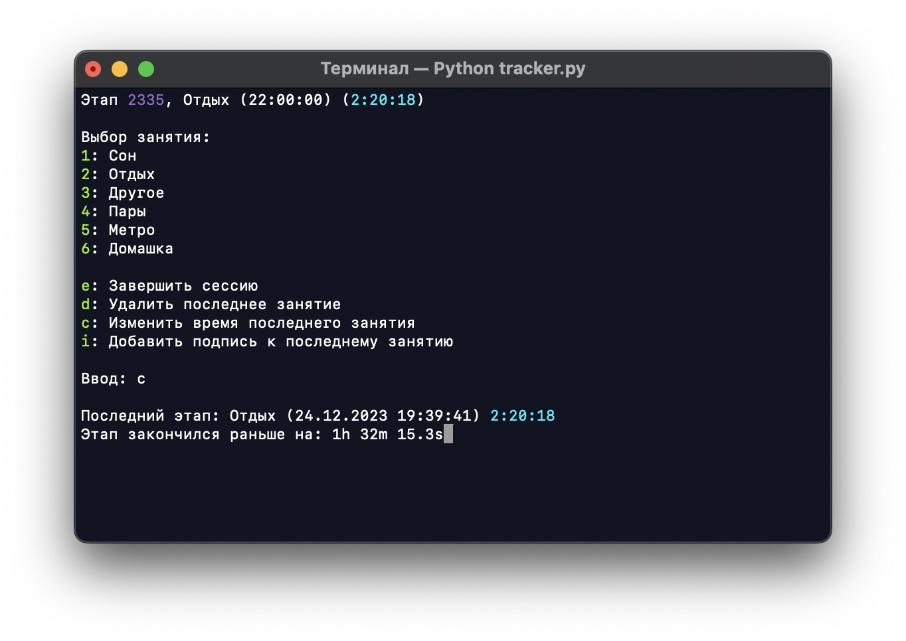

# Tracker
Небольшое консольное приложения для мониторинга свободного времени и несколько скриптов для аналитики полученных данных.

## Установка
Для работы необходим [Python3](https://www.python.org), модуль `matplotlib` для графиков и модуль `PIL` и `numpy` для генерации кружочка времени

```
pip3 install -r requirements.txt
```
  
## Использование
Трекер управляется вручную, после каждого этапа устанавливается следующий. Временная метка нового этапа появляется сразу после завершения предыдущего этапа, таким образом невозможно сделать пробел во времени начала одного события и конца другого. 


Отдельные параметры выделены своими цветами:
* Фиолетовый - число этапов
* Белый - время начала этапа (временная метка)
* Бирюзовый - продолжительность этапа
* Зелёный - доступный пользователю ввод

Также доступно изменение и удаление последних этапов, добавление пояснительных подписей. 

При удалении последнего этапа предпоследний займёт всё его время:
```
    До удаления           После удаления
| 1 этап | 2 этап | --> |     1 этап      |
```

При изменении времени последнего этапа можно пользоваться константами для часа, минуты и секунды, синтаксис общего выражения такой же как и для обычного калькулятора. Также изменение времени просиходит по следующему принципу: последний этап закончился раньше на `??` секунд. 

```
| 1 этап | 2 этап |
            + <-- ^
```



При завершении сессии программа выведет простую статистику всего сохранения. 


Само сохранение находится в файле `save.py`, все данные в котором поддаются редактированию. Последние две ячейки каждого массива нужны для более лёгкого поиска нужных точек и их редактирования, в скрипте временные метки отчитываются в формате unix-time. (Для изменения активности меняйте её unix-time метку в сохранении)


## Аналитика
Помимо простой аналитики после завершения сессии трекера, можно запустить скрипты, генерирующие графики на основе файла сохранения. Оба скрипта одинаковые, просто формат графиков разный. 

`bar.py`  


`barh.py`  


Также при больших сохранениях (от 15 недель) может быть полезен скрипт для отображения вего сохранения целиком на одном изображении.

`map.py`


Также на основе данных можно сгенерировать изображение - кружочек времени. На изображении точками отмечены даты начала этапов. Сам круг представляет 24 часовой циферблат, вверху полночь.


## Настройки
В файле `constants.py` содержатся константы для всех скриптов, настройки предлгаемых этапов для трекера, параметры генерации графиков и кружочка времени. 

Если вы хотите расширить или заменить этапы на свои собственные, то следует изменить словарь `ACTIVITIES`, добавив названия новых активностей и их цвета (цвета будут использованы для рисования графиков и кружочка). Заодно вы можете использовать активность с названием "Void", она будет отображаться как пустота на графике. 

При создании этапа `Другое` сразу спрашивается подпись к этапу. Если вы введёте пустую подпись, то она будет заменена подписью по умолчанию - `ANOTHER_DEFAULT_NOTE` (Магазин).

Если данных слишком много, то окна графиков (bar, barh) могут занимать больше одного экрана, для того, чтобы ограничить размер окна графиков, можно установить переменную `FULL` на противоположное значение. 
